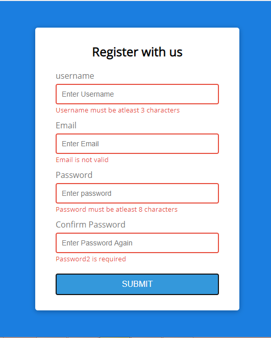

# Form Validator

This is a basic Form Validator made in vanilla Javascript.

# Basic Form

This is the Basic Layout.

# Checking Validity

It also checks if the input fields are filled in properly.

(Note: It does not have a database so the deatils are not submitted anywhere)
